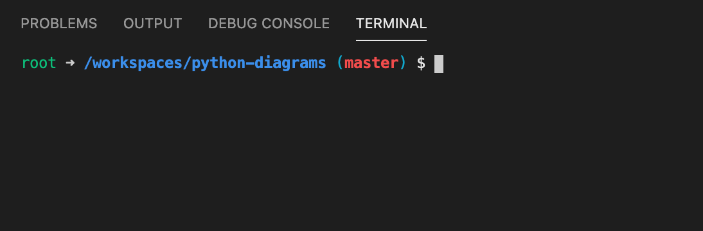
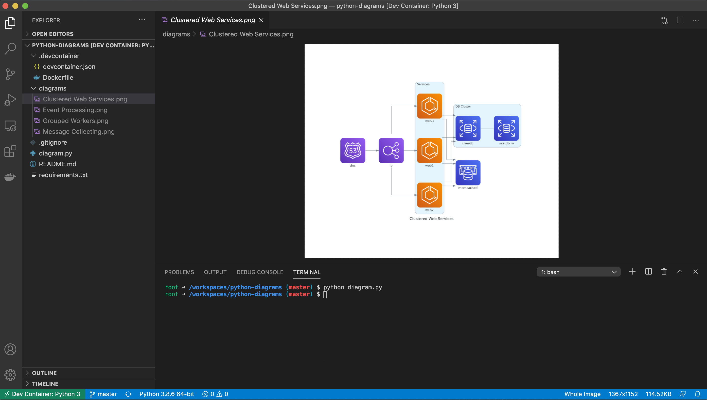

<h3 align="center">
    Um exemplo de como utilizar o Phyton Diagrams para gerar diagramas de arquitetura de sistemas em nuvem, bonitos, com poucas linhas de código e usando Remote-Containers do VSCode.
</h3>

<p align="center">
  

  

  <a href="https://www.twitter.com/pedrorenan/">
    
  </a>
  
  <a href="https://github.com/tgmarinho/README-ecoleta/commits/master">
    
  </a>
    
   
   <a href="https://github.com/pedrorenan/python-diagrams/stargazers">
    
  </a>
  
</p>


Tabela de conteúdos
=================
<!--ts-->
   * [Sobre o projeto](#-sobre-o-projeto)
   * [Funcionalidades](#-funcionalidades)
   * [Como executar o projeto](#-como-executar-o-projeto)
     * [Pré-requisitos](#pré-requisitos)
   * [Como contribuir no projeto](#-como-contribuir-no-projeto)
   * [Autor](#-autor)
   * [Licença](#user-content--licença)
<!--te-->


## 💻 Sobre o projeto

A idéia surgiu da leitura desse artigo aqui sobre ["Como criar belos diagramas de arquitetura  usando Python"](https://towardsdatascience.com/create-beautiful-architecture-diagrams-with-python-7792a1485f97). Existem várias ferramentas visuais para fazer isso, mas geralmente elas não fazem só diagramas de arquitetura e se são boas, não são gratuítas.

Achei essa solução bem interessante e testei com as instruções do artigo acima e também verificando a [documentação oficial do Diagrams](https://diagrams.mingrammer.com/docs/getting-started/installation). O incremento que fiz foi fazer o projeto utilizando os recursos da extensão [Remote-Containers](https://marketplace.visualstudio.com/items?itemName=ms-vscode-remote.remote-containers) do [VSCode](https://code.visualstudio.com/download).

---

## ⚙️ Funcionalidades

Gera diagramas de arquitetura de sistemas em nuvem usando Python.
  
---


## 🚀 Como executar o projeto


### Pré-requisitos

Desde que você tenha instalado no seu computador o [VSCode](https://code.visualstudio.com/download) e a extensão [Remote-Containers](https://marketplace.visualstudio.com/items?itemName=ms-vscode-remote.remote-containers),  não tem pré-requisito algum, é só rodar o projeto! 😲

Instruções:

```bash

# Clone este repositório
$ git clone https://github.com/pedrorenan/python-diagrams.git

# Acesse a pasta do projeto no terminal/cmd
$ cd python-diagrams

# Abra o projeto com o VSCode
$ code .
```
Quando o  [VSCode](https://code.visualstudio.com/download) abrir você verá uma mensagem informando que foram detectadas as configurações necessárias para que a extensão  [Remote-Containers](https://marketplace.visualstudio.com/items?itemName=ms-vscode-remote.remote-containers) faça a mágica acontecer.

<p align="center">
  
</p>

Clique em "Reopen in Container". O [VSCode](https://code.visualstudio.com/download) vai reiniciar e é só aguardar o ambiente ficar pronto para você. Pode demorar um pouco na primeira vez se você nunca tiver feito o download dos containers necesários 🕐. Mas vale a pena!

<p align="center">
  
</p>

Quando finalizar, você terá um terminal dentro do [VSCode](https://code.visualstudio.com/download) que já está dentro do container. Tudo integrado! Tipo [Inception](https://www.imdb.com/title/tt1375666/) mesmo 🍿. 

💡 Tudo que você executar nesse terminal será executado dentro do container apenas!

Então vamos ao útlimo passo:

```bash
# Gere os diagramas
$ python diagram.py
```
 
 Os diagramas serão gerados em uma pasta chamada "diagrams", mas você pode alterar isso se quiser  😀. Olha como fica bonitão:

<p align="center">
  
</p>


## 💪 Como contribuir no projeto

1. Faça um **fork** do projeto.
2. Crie uma nova branch com as suas alterações: `git checkout -b my-feature`
3. Salve as alterações e crie uma mensagem de commit contando o que você fez: `git commit -m "feature: My new feature"`
4. Envie as suas alterações: `git push origin my-feature`
> Caso tenha alguma dúvida confira este [guia de como contribuir no GitHub](./CONTRIBUTING.md)

---

## 🦸 Autor


[](https://twitter.com/pedrorenan) [](https://www.linkedin.com/in/opedrorenan/) 
[](mailto:pedrorenan@gmail.com)

---

## 📝 Licença

Este projeto esta sobe a licença [MIT](./LICENSE).

Feito com ❤️ por Pedro Renan 👋🏽 [Entre em contato!](https://www.linkedin.com/in/opedrorenan/)

---